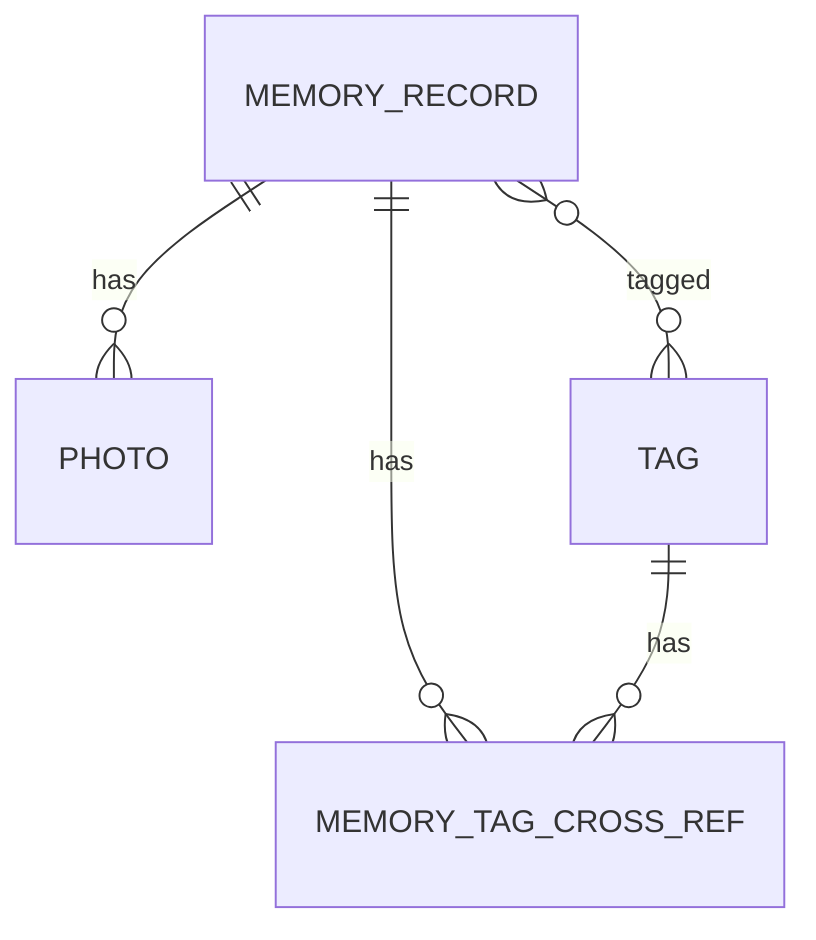

# 岁迹 LifeAtlas 数据模型设计

## 1. 设计原则

- 结构化数据存 Room
- 图片文件不直接存数据库
- 记录、照片、标签解耦
- 删除记录时清理关联关系
- 预留后续同步和数据导出能力

## 2. 核心实体

### 2.1 MemoryRecord

人生记录，是产品的核心实体。

| 字段 | 类型 | 必填 | 说明 |
| --- | --- | --- | --- |
| id | Long | 是 | 本地主键 |
| remoteId | String? | 否 | 后续云同步 ID |
| title | String | 是 | 标题 |
| content | String | 否 | 正文 |
| recordTime | Long | 是 | 事件发生时间 |
| latitude | Double? | 否 | 纬度 |
| longitude | Double? | 否 | 经度 |
| locationName | String? | 否 | 地点名称 |
| mood | String? | 否 | 心情 |
| importance | Int | 否 | 重要程度，默认 3 |
| createdAt | Long | 是 | 创建时间 |
| updatedAt | Long | 是 | 更新时间 |
| deletedAt | Long? | 否 | 软删除时间，后续同步使用 |
| syncState | String? | 否 | 后续同步状态 |

### 2.2 Photo

照片实体，用于保存图片引用和派生文件路径。

| 字段 | 类型 | 必填 | 说明 |
| --- | --- | --- | --- |
| id | Long | 是 | 本地主键 |
| recordId | Long | 是 | 关联记录 ID |
| originalUri | String | 是 | 原图 URI |
| thumbnailPath | String? | 否 | 缩略图路径 |
| compressedPath | String? | 否 | 压缩图路径 |
| takenAt | Long? | 否 | 拍摄时间 |
| latitude | Double? | 否 | 照片纬度 |
| longitude | Double? | 否 | 照片经度 |
| createdAt | Long | 是 | 创建时间 |

### 2.3 Tag

标签实体。

| 字段 | 类型 | 必填 | 说明 |
| --- | --- | --- | --- |
| id | Long | 是 | 本地主键 |
| name | String | 是 | 标签名 |
| color | String? | 否 | 标签颜色 |
| createdAt | Long | 是 | 创建时间 |

### 2.4 MemoryTagCrossRef

记录和标签的多对多关联。

| 字段 | 类型 | 必填 | 说明 |
| --- | --- | --- | --- |
| recordId | Long | 是 | 记录 ID |
| tagId | Long | 是 | 标签 ID |

### 2.5 Person

人物实体，MVP 暂不实现，但预留模型。

| 字段 | 类型 | 必填 | 说明 |
| --- | --- | --- | --- |
| id | Long | 是 | 本地主键 |
| name | String | 是 | 姓名 |
| avatarUri | String? | 否 | 头像 URI |
| note | String? | 否 | 备注 |
| createdAt | Long | 是 | 创建时间 |

## 3. Room 表规划

```text
memory_records
photos
tags
memory_tag_cross_ref
persons
```

## 4. 关系说明



## 5. 导出 JSON 草案

```json
{
  "schemaVersion": 1,
  "app": "LifeAtlas",
  "exportedAt": 1782144000000,
  "records": [
    {
      "id": 1,
      "title": "第一次拿到房本",
      "content": "今天终于拿到了房本。",
      "recordTime": 1781452800000,
      "locationName": "武汉市洪山区",
      "latitude": 30.5,
      "longitude": 114.3,
      "mood": "激动",
      "importance": 5,
      "photos": [],
      "tags": ["买房", "武汉", "人生节点"]
    }
  ]
}
```

